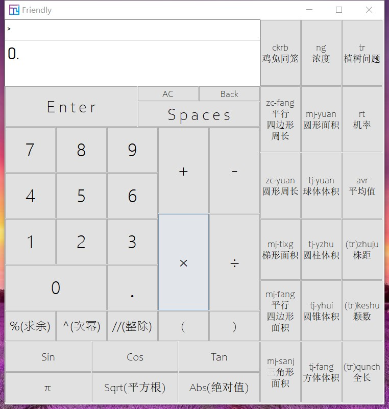
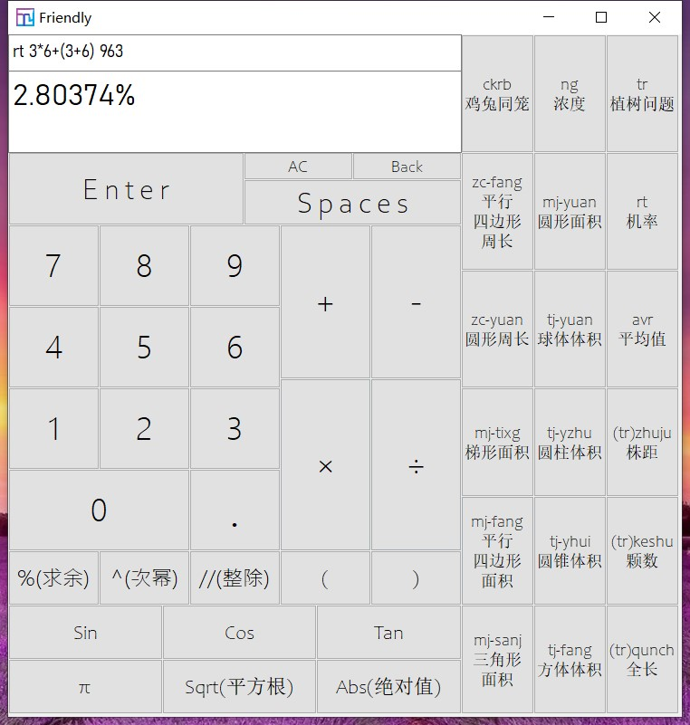
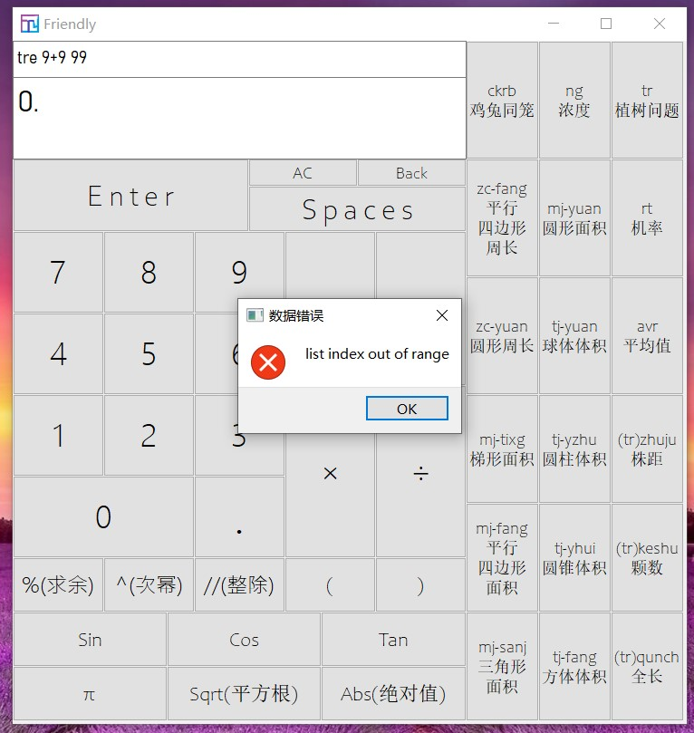

# Friendly #

[中文](./README_CN.md)

##### *He is a very good friend, a nice friend. He's friendly and clever, can do many things About the calculation.*

###### **Version**

**v4.0.0**

###### **New Features**

- ***Simplify code***
- ***The bug fixed are:***
  
  *1.Multiple decimal points can be used in a number.*
  
  *2.Multiple commands can be used in one line.*

###### **Function Screenshot**

1.At startup

2.When calculating

3.When an error occurs

