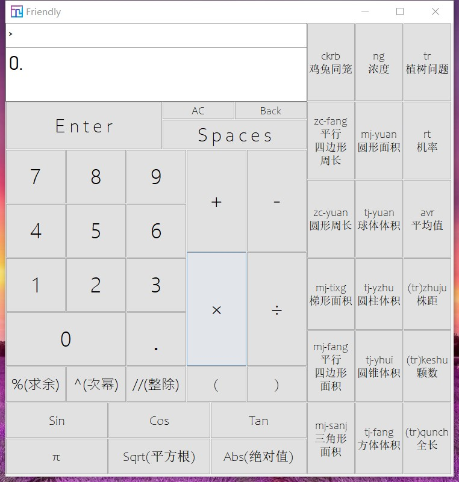
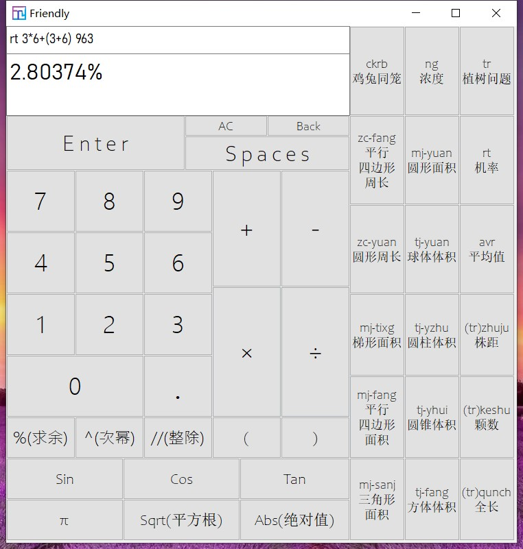
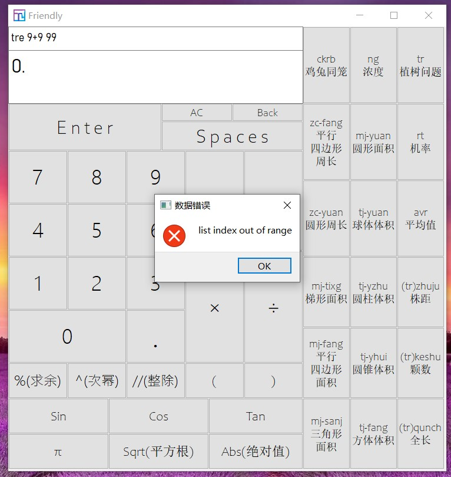

# Friendly #

[English](./README.md)

##### *他是一个好的朋友，一个很好的朋友，一个非常好的朋友。他友好又聪明，能做许多关于计算的事情。*

###### **版本号**

**v4.0.0**

###### **新特性**

- **简化代码**

- **修复的漏洞：**

  *1.一个数可以用多个小数点*

  *2.一个命令行中有多个命令*

###### 功能截图

1.启动时

2.计算时

3.出错时

